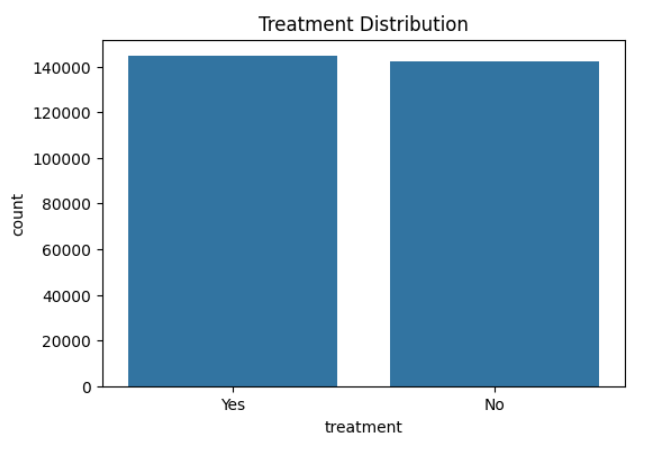

# **MentalCare Predictor: Sentiment Analysis Model**

## **Project Overview**

The **MentalCare Predictor** project aims to create a **Sentiment Analysis Model** to predict mental health outcomes based on lifestyle, personal history, and social factors. By identifying individuals at risk early, healthcare professionals can offer proactive support and intervention.

### **Goal**:
To build a tool that helps healthcare professionals identify individuals who may need mental health support early, thereby improving patient outcomes.

### **Stakeholders**:
- **Psychologists**, **Psychiatrists**, **General Practitioners**, and **Mental Health Counselors**: These professionals can use the tool to prioritize interventions, allocate resources, and improve mental health outcomes.

### **Business Question**:
- **Who is likely to seek mental health treatment?**  
  The project predicts the likelihood of an individual needing mental health treatment based on factors like lifestyle, occupation, and family history.

---

## **Dataset**

- **Source**: Kaggle - [Mental Health Dataset](https://www.kaggle.com/datasets/divaniazzahra/mental-health-dataset)
- **Target Variable**
  - **treatment**
- **Features (to name a few)**:
  - **Timestamp**
  - **Gender**
  - **Country**
  - **Occupation**
  - **self_employed**
  - **days_indoors**
  - **mental_health_issues**
 

---

## **Model Development**

### **Data Preprocessing**
- **Data Cleaning**: 
  - Handled missing values
  - checked for outliers
  - Dropped timestamp column
  - Deleted duplicates
- **Feature Engineering**: 
  - **encoded** categorical variables for Logistic Regression and MLP algorithms.
  - performed **correlation analysis**  


### **Exploratory Analysis** - 
 Analyzed the distribution of the target variable and the impact of the target variable on other features


### **Models Used**
- **MLP (Multi-Layer Perceptron)**: A neural network model for capturing deep, complex relationships in the data to improve prediction accuracy.


- **Logistic Regression**: A basic classification model used as a benchmark to predict whether an individual needs treatment (binary classification).


- **CatBoost**: A gradient boosting model optimized for **categorical features**, providing high performance with less data preprocessing.


### **Feature Importance on Catboost Model**: This was done to determine the features that had more effect on the target. 


### **Model Evaluation**
- **Accuracy**: Achieved **78.63%** accuracy using **CatBoost**.
- **Precision, Recall, and F1-Score**: Evaluated the model’s ability to predict mental health outcomes correctly, with a focus on minimizing false positives and false negatives.
- **Key Insights**: country, occupation, and family history were found to be significant predictors for mental health treatment needs.


### **Tuning and Optimization**
- **Hyperparameter Tuning**: Used **feature selection** and **tuning** to optimize model hyperparameters and enhance prediction accuracy.


---

## **Deployment**

### **Flask Web Application**
- Developed a **Flask web application** that allows healthcare providers and employers to input real-time data (e.g., occupation, family history) and receive predictions on mental health outcomes.
- **Flask** was chosen for its simplicity and ease of deployment, creating an interactive interface for end-users.

### **AWS EC2 Hosting**
- The Flask application was deployed on **AWS EC2** to ensure scalability and reliable access.
  
#### **EC2 Deployment Steps**:
1. **Create EC2 Instance**: Launch a new EC2 instance with Amazon Linux as the operating system.
2. **SSH Access**: Connect to the EC2 instance using SSH:
   ```bash
   ssh -i <your-key-pair.pem> ubuntu@<ec2-public-ip>
   ```
3. **Install Dependencies**:
   - Install Python and libraries:
     ```bash
     sudo apt update
     sudo apt install python3-pip
     pip3 install -r requirements.txt
     ```
4. **Transfer and Deploy**:
   - Upload your Flask app to the EC2 instance (using SCP or Git).
   - Start the Flask app:
     ```bash
     python3 app.py
     ```
5. **Configure Security**: Ensure the EC2 security group allows traffic on ports 80 (HTTP) or 5000 (Flask default).
6. **Access Application**: The web application will be accessible via the public IP of the EC2 instance.

---

## **Key Results**

- **Accuracy**: Achieved **78.63%** accuracy using **CatBoost**. 
- **Insights**: Key predictors such as **family history**, **occupation**, and **country** significantly influenced the prediction of mental health treatment needs.
- **Impact**: The model enables **early detection** and supports **proactive intervention** in mental health management.

---

## **Future Work**

- **Integration with Wearable Data**:  
  - Incorporate real-time health data from wearable devices (e.g., Fitbit, Apple Watch) to enhance the model’s predictive accuracy. This would allow for continuous monitoring of individuals' physical and mental health, providing more personalized and timely predictions for mental health interventions.

---

## **Installation**

To run this project locally, clone the repository and install the required dependencies:

```bash
git clone <repository_url>
cd <repository_folder>
pip install -r requirements.txt
```

### **Run the Application**
To start the Flask application, run:

```bash
python app.py
```

The app will be available at `http://127.0.0.1:5000/`.

---


